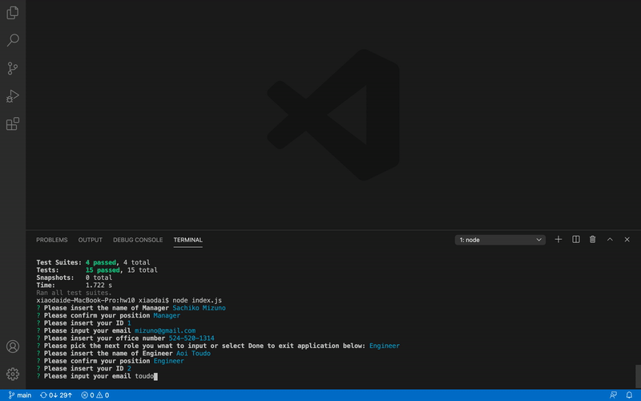

   

# 10.Team Profile Generator

## Description
We had been learning how to arrange test and classes with constructor function during the past week. This is the practice we use the skills that we had learn all together to make the team profolio generator. I learn how to structure test.js and module first. It was challenge to connect all of the parts correctly. Over all I enjoy the process of solving the quesion that comes up and building this generator (also a little bit of styling). 

## Installation
npm package is need. (Please install it by typing npm i in your terminal)

## Usage

Demo:

 

## License
MIT 

## Badges

## Questions
        Please feel free to contact: 
        Github:https://github.com/anniechen9025/
        Email:anniechen9025@gmail.com
